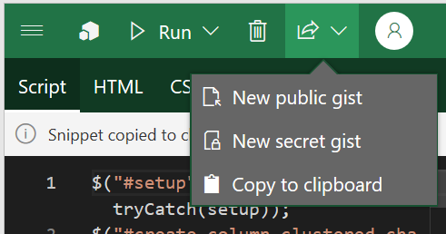
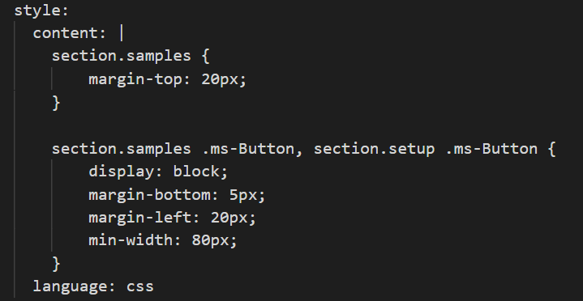

# Office-Addin-TaskPane

This repository is based on the source code used by the [Yo Office generator](https://github.com/OfficeDev/generator-office) when you create a new Office Add-in that appears in the task pane. It is meant as a starting point for developers who are using Script Lab and would like to create a full-fledged Office Add-in.

## Prerequisites

Before using this template, ensure that you have the following installed on your machine:
- [Git](https://git-scm.com/book/en/v2/Getting-Started-Installing-Git)
- [Node.js](https://nodejs.org/en/)
- [Visual Studio Code](https://code.visualstudio.com/download) (or your own text editor)
- An Office subscription
- a command prompt (or terminal if on Mac)

> Command prompts and terminals are normally preinstalled on your machine if you are on Windows or Mac respectively


## Getting started

1. Open a command prompt or terminal and run the following command to download this sample: 

    ```
    git clone https://github.com/nokafor/Office-Addin-TaskPane
    ```

2. Run the following commands to navigate to the project root and install all the required dependencies.

    ```
    cd Office-Addin-Taskpane
    npm install
    ```

3. Once the install is finished, run the following to open the project in VS Code:

    ```
    code .
    ```

> If you do not have Visual Studio Code installed, open the following project files in your favorite text editor.


4. Go back to the Code page in Script Lab, and copy your Script Lab snippet to clipboard

    
  
  
5. Paste contents into the "script-lab.txt" file in your project.

6. In script-lab.txt, find the "content:" section under "style". 

    

7. Copy the styling content and paste at the bottom of taskpane.css in the src/taskpane folder of the project. Save the changes.

8. In the script-lab.txt file, find the content section under "template". Copy the template content.

9. Navigate to the taskpane.html file in the src/taskpane folder of the project. Replace the existing content between the <main></main> tags in this document with the information you copied from the script-lab.txt file. Save the changes.

10. In the script-lab.txt file, find the content section under "script". Copy this script content.

11. Navigate to the taskpane.ts file in the src/taskpane folder of the project. Replace the entire content of the file with the information you copied from the script-lab.txt file in the previous step. At the top of the taskpane.ts file, add the following line:

        ```
        var $ = require( "jquery" );
        ```

12. Save the changes in taskpane.ts, and open the command prompt or terminal again. Run "npm run build" in the project folder to build the changes.

13. Run "npm start" in the command prompt to sideload the add-in and ensure it works.


## TypeScript

This template is written using [TypeScript](http://www.typescriptlang.org/). For the JavaScript version of this template, go to [Office-Addin-TaskPane-JS](https://github.com/OfficeDev/Office-Addin-TaskPane-JS).


## Debugging

This template supports debugging using any of the following techniques:

- [Use a browser's developer tools](https://docs.microsoft.com/office/dev/add-ins/testing/debug-add-ins-in-office-online)
- [Attach a debugger from the task pane](https://docs.microsoft.com/office/dev/add-ins/testing/attach-debugger-from-task-pane)
- [Use F12 developer tools on Windows 10](https://docs.microsoft.com/office/dev/add-ins/testing/debug-add-ins-using-f12-developer-tools-on-windows-10)

## Questions and comments

We'd love to get your feedback about this sample. You can send your feedback to us in the *Issues* section of this repository.

Questions about Microsoft Office 365 development in general should be posted to [Stack Overflow](http://stackoverflow.com/questions/tagged/office-js+API).  If your question is about the Office JavaScript APIs, make sure it's tagged with  [office-js].

## Additional resources

* [Office add-in documentation](https://docs.microsoft.com/office/dev/add-ins/overview/office-add-ins)
* More Office Add-in samples at [OfficeDev on Github](https://github.com/officedev)

This project has adopted the [Microsoft Open Source Code of Conduct](https://opensource.microsoft.com/codeofconduct/). For more information, see the [Code of Conduct FAQ](https://opensource.microsoft.com/codeofconduct/faq/) or contact [opencode@microsoft.com](mailto:opencode@microsoft.com) with any additional questions or comments.

## Copyright

Copyright (c) 2019 Microsoft Corporation. All rights reserved.
